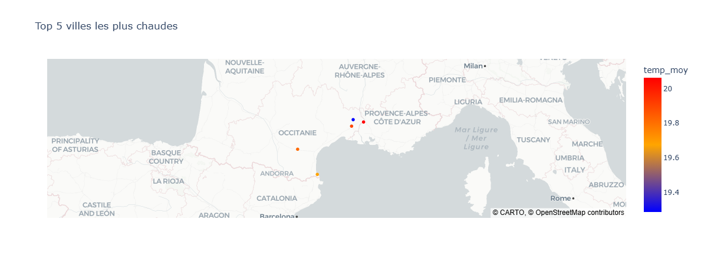
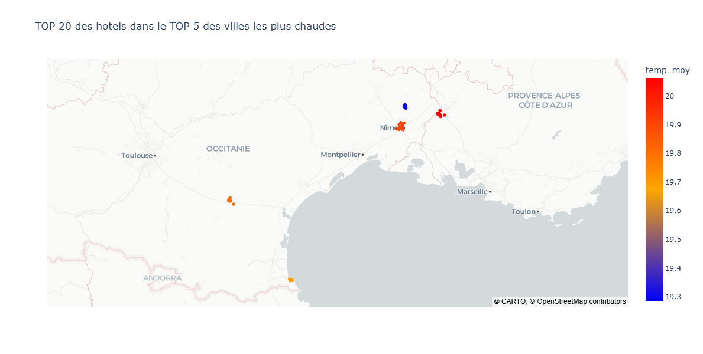

# 🛶 Projet Kayak – Data Pipeline & Recommandations

## 📌 Contexte

Le projet **Kayak** consiste à construire un pipeline de données permettant de récupérer, traiter et analyser des informations sur les **conditions météo** et les **hôtels** dans plusieurs villes.
L’objectif final est de créer un outil d’aide à la décision qui permet d’identifier :

* Les **meilleures villes** selon la météo (températures élevées et faible pluie)
* Le **top 20 des hôtels** dans ces villes selon leurs notes Booking

---

## 🎯 Objectifs

* Collecter des données météo via **API** et des données hôtelières via **Scraping Booking (Scrapy)**
* Traiter et nettoyer les données (gestion des batchs, fusion GPS + météo)
* Stocker les données sur **Amazon S3** puis les intégrer dans **NeonDB**
* Créer des visualisations interactives (cartes Plotly)

---

## 🛠️ Stack technique

* **Python** (pandas, requests, scrapy, plotly)
* **AWS S3** pour le stockage
* **NeonDB (PostgreSQL cloud)** pour la base de données
* **Plotly** pour les cartes et visualisations

---

## 🔄 Pipeline de données

1. **Extraction**

   * API météo (température, précipitations)
   * Scrapy pour récupérer infos Booking (nom hôtel, note, description, GPS, URL)
2. **Transformation**

   * Nettoyage et fusion des données
   * Agrégation par ville et calcul d’indicateurs météo
3. **Chargement (Load)**

   * Données stockées sur **S3**
   * ETL vers **NeonDB**
4. **Analyse & Visualisation**

   * Requête SQL pour extraire les 5 villes les plus chaudes avec le moins de pluie
   * Carte Plotly avec le top 20 hôtels dans ces villes

---

## 📊 Résultats

* Carte des **5 villes les plus attractives** (chaleur + peu de pluie)

* Carte interactive des **20 meilleurs hôtels** dans ces villes selon Booking

---

## 🚀 Améliorations possibles

* Intégrer plus de sources météo (données en temps réel)
* Prendre en compte la **saisonnalité** (variations météo selon mois)
* Ajouter d’autres critères hôteliers (prix, équipements, distance centre-ville)
* Déployer un **tableau de bord Streamlit**

---

## 👨‍💻 Auteur

Projet réalisé dans le cadre du **Bootcamp Data Fullstack – Jedha**.
Auteur : MARC

---

